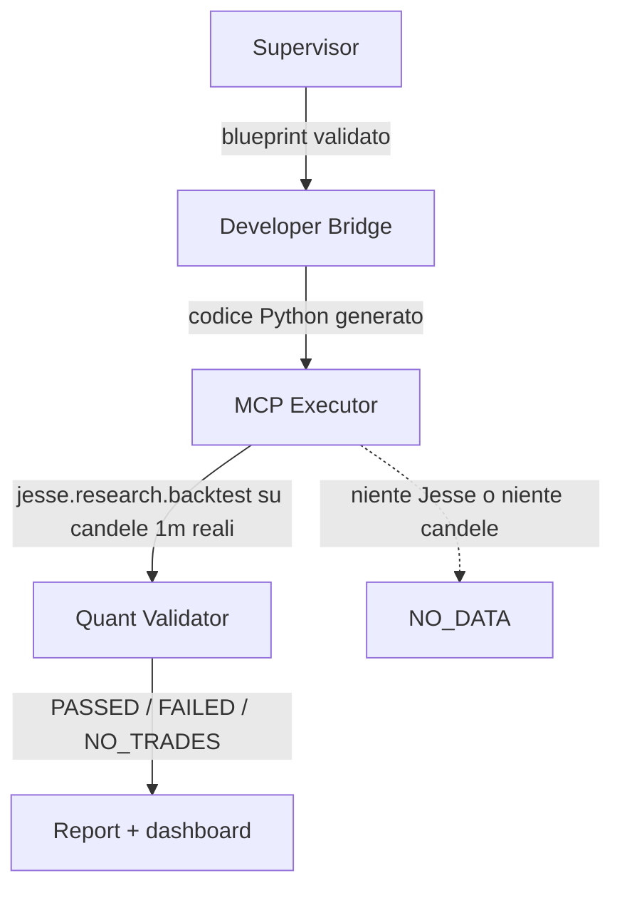

# Sovereign Quant Engine (SQE)

Una pipeline che genera strategie di trading algoritmico da specifiche JSON, le esegue su dati di
mercato reali, e ne riporta il risultato con la provenienza allegata.

**Stato: ricerca conclusa, nessuna strategia promossa.** Il motore misura onestamente. Le sei
strategie candidate testate non hanno superato la soglia statistica, e il progetto si è fermato
prima di scrivere qualunque layer di esecuzione. Non c'è codice che possa inviare un ordine, e non
ce ne sarà finché non esisterà qualcosa da eseguire.

---

## Cosa ha misurato

Su **11.115 candele a 4h** e **1.402.560 candele a 1 minuto** di Bybit spot BTCUSDT, scaricate
dall'endpoint pubblico con hash e report di completezza
([`research/`](research/README.md)):

**La strategia specificata in `alpha_spec.json` non apre nessuna posizione.** Zero, in cinque anni.
`rsi(14) < 30` e `close > sma(50)` hanno correlazione **+0.870** — misurano la stessa cosa, quindi
richiederle insieme è richiedere che il prezzo scenda e salga contemporaneamente. L'RSI più basso
mai osservato mentre il prezzo sta sopra la sua media è **36.59**; la soglia è 30.

**Le commissioni hanno la stessa taglia dell'edge disponibile.**

| | win rate |
|---|---|
| ingressi casuali | 35.42 % |
| pareggio dopo commissioni | **36.66 %** |
| incrocio di medie mobili classico | **36.67 %** |

**Il limite di drawdown del 2 % non era raggiungibile.** BTC sta più del 2 % sotto il proprio
massimo il **91.6 %** del tempo, e zero percorsi casuali su mille sono rimasti sotto quella soglia.
L'esposizione necessaria per rispettarla produce ordini sotto il minimo di 5 USDT dell'exchange.

**Due esperimenti pre-registrati, entrambi refutati.** Regole committate prima dell'esecuzione,
eseguiti una volta sola, nessuna soglia rinegoziata dopo.

- **EXP-001** — sei segnali tecnici classici su BTC, soglia al 99.17° percentile (Bonferroni).
  Zero superati; il migliore al 75°.
- **EXP-002** — momentum cross-sectional su 416 coppie, ribilanciato ogni 28 giorni.
  **Allo 0.5° percentile** della selezione casuale: peggio del 99.5 % delle scelte a caso, con
  dodici celle di sensibilità tutte negative. L'ipotesi esiste con il segno rovesciato.

Dettaglio: [`research/RESULT_P0-1.md`](research/RESULT_P0-1.md) ·
[`research/RESULT_DOMAIN.md`](research/RESULT_DOMAIN.md) ·
[`research/EXPERIMENT_REGISTER.md`](research/EXPERIMENT_REGISTER.md)

---

## Come è fatto



**Supervisor** ([`supervisor.py`](core_engine/supervisor.py)) — valida gli input contro schemi JSON
e applica i limiti di rischio. Stop e take-profit devono essere positivi: `(-0.04)/(-0.02)` fa 2.0,
e due negativi passavano il controllo di rischio/rendimento.

**Developer Bridge** ([`developer_bridge.py`](core_engine/developer_bridge.py)) — genera la
strategia Jesse. Ogni condizione d'ingresso passa da un parser AST che accetta solo aritmetica,
confronti e nomi dichiarati; chiamate di funzione e accessi ad attributi sollevano. I parametri
degli indicatori devono essere **numeri**, e vengono emessi come `repr()` di un valore validato,
mai come il testo del chiamante. Il file viene analizzato con `ast.parse` **prima** di toccare il
disco.

**MCP Executor** ([`mcp_executor.py`](core_engine/mcp_executor.py)) — esegue il backtest in-process
con `jesse.research.backtest()` su candele a 1 minuto reali. **Non esiste un percorso mock.**
`SUCCESS` richiede candele; tutto il resto è `NO_DATA` con `metrics = None`. Ogni risultato porta
la provenienza: origine del dato, sha256, exchange, commissioni, hash della strategia, finestra.

**Quant Validator** ([`quant_validator.py`](core_engine/quant_validator.py)) — gate sulle metriche
e Monte Carlo bootstrap. Una metrica mai misurata **solleva** invece di saltare il controllo. Un
verdetto positivo richiede provenienza tracciata. Zero trade è riportato come `NO_TRADES`, non
ricampionato in un rischio di rovina dello 0 %.

**Risk Optimizer** ([`optimizer.py`](core_engine/optimizer.py)) — **sospeso**, nessuno lo invoca.
Cercava il parametro sulla stessa finestra su cui poi riportava il verdetto.

Perché la granularità a 1 minuto conta: con uno stop al 2 % e un target al 4 %, una barra a 4h che
attraversa entrambi non dice quale sia arrivato prima, e assumere quello favorevole è il modo in cui
una strategia perdente risulta vincente nel backtest.

---

## Esecuzione

```bash
git clone https://github.com/pomello03/sovereign-quant-engine.git
cd sovereign-quant-engine
pip install -r requirements.txt
python -m pytest -p no:anyio -q          # 115 test
```

Il flag `-p no:anyio` è obbligatorio: Jesse fissa `pytest~=6.2.5`, che confligge con il plugin anyio.

```bash
python run_simulation.py
```

Restituisce `NO_DATA` — corretto: Jesse non è nell'ambiente principale, quindi non c'è misura.
Gli exit code distinguono i casi: `0` superato, `1` non superato, `2` nessuna misura, `3` errore.

Per un backtest reale servono Jesse in un interprete separato e le candele, entrambi descritti in
[`research/README.md`](research/README.md). Jesse resta fuori dal venv principale perché fissa
`pytest~=6.2.5` e perché importa ed esegue il codice generato.

---

## Struttura

```
core_engine/      supervisor · developer_bridge · mcp_executor · quant_validator · optimizer · state_io
research/         misurazione, deliberatamente senza dipendenze da core_engine
  strategies/     SpecStrategy (l'alpha_spec, scritta a mano) e ControlStrategy (il controllo)
  results/        ogni risultato con hash del dato, finestra, commissioni, rendimenti per trade
payload_drop/     confine di I/O: specifiche in ingresso, blueprint e report in uscita
schemas/          schemi JSON — vincolanti, perché ogni valore diventa codice Python
tests/            115 test
docs/             audit, protocollo di validazione e gate, threat model e runbook
plans/            roadmap verso un eventuale live controllato
```

---

## Sicurezza

**Tutto ciò che arriva da `alpha_spec.json` diventa sorgente Python.** Qui è vissuta una RCE
confermata: un valore in `indicators[].params` veniva interpolato in una f-string, quindi
`{"period": "14, __x=open(...).write(...)"}` produceva Python valido che girava al primo accesso
all'indicatore — in silenzio, perché il getter è avvolto in `try/except`. Tre livelli indipendenti
ora la fermano, con 16 test di regressione in
[`tests/test_rce_regression.py`](tests/test_rce_regression.py).

Nessun LLM è mai nel percorso critico di un ordine. Il threat model e il runbook operativo stanno
in [`docs/THREAT_MODEL_AND_RUNBOOK.md`](docs/THREAT_MODEL_AND_RUNBOOK.md).

---

## Cosa riaprirebbe la ricerca

Non un'altra passata di segnali tecnici: quella è stata fatta, una volta, con le regole fissate in
anticipo, e ha risposto.

Serve un'**ipotesi di mercato con un meccanismo** — una ragione per cui qualcuno dovrebbe essere
disposto a stare dall'altra parte del trade — dichiarata prima di guardare i dati e registrata in
[`research/EXPERIMENT_REGISTER.md`](research/EXPERIMENT_REGISTER.md). L'infrastruttura per
valutarla onestamente esiste; l'ipotesi no.

I criteri di abbandono, i gate di promozione e il protocollo statistico completo sono in
[`docs/VALIDATION_AND_LIVE_GATES.md`](docs/VALIDATION_AND_LIVE_GATES.md).
