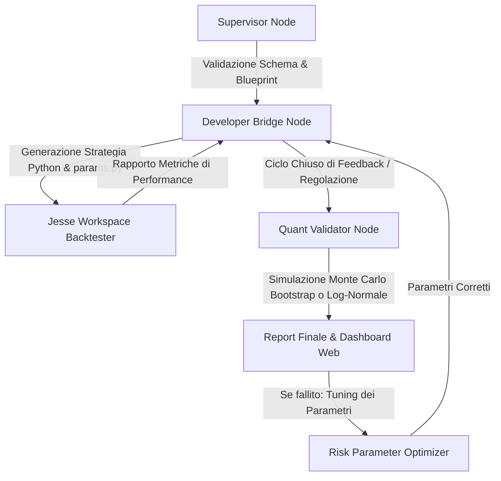

# Sovereign Quant Engine (SQE)

Il **Sovereign Quant Engine (SQE)** è un'infrastruttura automatizzata a ciclo chiuso (Closed-Loop) progettata per tradurre specifiche logiche ad alto livello in strategie di trading algoritmico sicure, ottimizzate e validate quantitativamente. Il sistema si interfaccia direttamente con il framework di trading algoritmico [Jesse](https://jesse.trade/).

Lo scopo principale del progetto è automatizzare l'intero ciclo di vita di una strategia quantitativa: dalla validazione iniziale delle regole, passando per la generazione sicura del codice Python e l'esecuzione dei backtest, fino alla validazione statistica tramite simulazioni Monte Carlo e alla calibrazione automatica del rischio per prevenire la rovina del capitale (*Risk of Ruin*).

---

## 📐 Architettura del Sistema

Il motore opera come un ciclo chiuso strutturato in 5 componenti principali:



### 1. Nodo di Supervisione ([supervisor.py](file:///C:/Users/francesco.bonino/Documents/SQE%20branch/core_engine/supervisor.py))
* **Scopo:** Agisce come gatekeeper all'inizio della pipeline. Si assicura che qualsiasi richiesta (payload) o configurazione in ingresso sia strutturalmente valida e non violi i limiti fondamentali di rischio.
* **Dettagli:** Valida i file di configurazione (`strategy_blueprint.json` e `risk_constraints.json`) rispetto a schemi JSON formali rigorosi. Blocca immediatamente l'esecuzione se rileva parametri di rischio assurdi o formati errati.

### 2. Ponte di Sviluppo ([developer_bridge.py](file:///C:/Users/francesco.bonino/Documents/SQE%20branch/core_engine/developer_bridge.py))
* **Scopo:** Genera il codice Python conforme a Jesse a partire dalle specifiche del blueprint.
* **AST Security Parser:** Per escludere attacchi di *code injection*, implementa un parser AST (Abstract Syntax Tree) che analizza formalmente le formule matematiche e le condizioni tecniche di ingresso/uscita (es. `close > EMA(50)`). Rifiuta qualsiasi istruzione non inclusa in una whitelist ristretta (esclude chiamate a funzioni esterne, importazioni di librerie arbitrarie o accessi a proprietà di sistema).
* **Regime Switching:** Mappa automaticamente parametri diversi a seconda del regime di mercato attivo (es. *trending_bullish*, *ranging_bearish*) e inietta il codice a runtime per commutare dinamicamente i parametri di risk management durante il backtest.

### 3. Validatore Quantitativo ([quant_validator.py](file:///C:/Users/francesco.bonino/Documents/SQE%20branch/core_engine/quant_validator.py))
* **Scopo:** Valuta l'affidabilità statistica della strategia superando i limiti del backtest classico.
* **Simulatore Monte Carlo Avanzato:** Esegue stress test per calcolare la probabilità di rovina (*Risk of Ruin*) e il Drawdown Massimo atteso tramite:
  - **Bootstrap Non-Parametrico (Empirico):** Se sono presenti i dati reali dei singoli trade eseguiti dal backtest, esegue un campionamento casuale con reinserimento per ricostruire migliaia di curve di equity, preservando la reale distribuzione di probabilità originaria (inclusi eventi fat-tail e asimmetrie).
  - **Mixture Log-Normale Parametrica:** Se mancano i log di trade storici dettagliati, genera campioni casuali sintetici basandosi sui macro-indicatori (Sharpe Ratio, Win Rate, Profit Factor, numero totale di operazioni) modellando distribuzioni asimmetriche realistiche.
* **Output:** Genera `validation_report.json` e aggiorna la dashboard visuale.

### 4. Ottimizzatore Parametri di Rischio ([optimizer.py](file:///C:/Users/francesco.bonino/Documents/SQE%20branch/core_engine/optimizer.py))
* **Scopo:** Se le metriche finali o la simulazione Monte Carlo indicano che la strategia supera le soglie di rischio (es. probabilità di rovina > 5% o drawdown > 15%), questo modulo interviene in modo iterativo.
* **Dettagli:** Scala dinamicamente la dimensione delle posizioni (`max_position_sizing_pct`), incrementa la severità dello stop loss (`stop_loss_value`) ed esegue nuovamente i cicli di backtest e validazione fino a trovare una configurazione compliant e sicura per il trading.

### 5. Monitor & Dashboard Web ([web_dashboard/](file:///C:/Users/francesco.bonino/Documents/SQE%20branch/web_dashboard/))
* **Scopo:** Un'applicazione web responsive basata su FastAPI e HTML5/Vanilla CSS che fornisce una visualizzazione in tempo reale di tutto il processo.
* **Dettagli:** Mostra un indicatore di progresso (stepper) del processo, metriche chiave di performance, un visualizzatore di log in tempo reale e un grafico interattivo (Chart.js) che illustra la traiettoria di calibrazione dell'ottimizzatore. Include tooltip informativi completi in lingua italiana.

---

## 📂 Struttura delle Directory

```bash
├── core_engine/                 # Implementazioni core del motore
│   ├── supervisor.py            # Validazione configurazioni e vincoli iniziali
│   ├── developer_bridge.py      # Generatore di codice Jesse & Parser AST
│   ├── quant_validator.py       # Motore di simulazione Monte Carlo e reportistica
│   ├── optimizer.py             # Calibrazione iterativa dei limiti di rischio
│   └── mcp_executor.py          # Orchestratore e gestore esecuzione di Jesse
├── payload_drop/                # File temporanei, blueprint, report e grafici
│   ├── strategy_blueprint.json  # Blueprint logico della strategia generata
│   ├── risk_constraints.json    # Soglie di rischio e vincoli massimi tollerati
│   ├── validation_report.json   # JSON con i risultati delle simulazioni Monte Carlo
│   └── validation_dashboard.html# Dashboard visuale locale esportata
├── jesse_workspace/             # Workspace di esecuzione per Jesse
│   ├── strategies/              # Contiene il codice Python autogenerato
│   ├── config.py                # Configurazione del database e dell'ambiente Jesse
│   └── routes.py                # Rotte e coppie di trading configurate
├── docs/                        # Guide operative e documentazione dettagliata
│   ├── git_workflow.md          # Regole del modello di sviluppo GitFlow
│   └── Guida Master Completa.md # Manuale tecnico dell'infrastruttura
├── tests/                       # Suite di test unitari (61 test passati)
├── run_simulation.py            # Script principale per eseguire la simulazione end-to-end
├── run_dashboard.bat            # Script batch per lanciare la dashboard web locale
├── push_to_github.bat           # Script helper per sincronizzare il lavoro su GitHub
├── requirements.txt             # Librerie e dipendenze Python richieste
└── .antigravity_rules.md        # Regole operative per l'agente IA
```

---

## 🚀 Guida all'Installazione e Setup

### 1. Clonazione del Progetto
Scarica il codice sorgente e posizionati nella cartella principale del progetto:
```bash
git clone https://github.com/pomello03/sovereign-quant-engine.git
cd sovereign-quant-engine
```

### 2. Installazione delle Dipendenze
Installa le librerie Python necessarie (incluso Jesse, jsonschema, pydantic e i motori di test/audit):
```bash
pip install -r requirements.txt
```

### 3. Esecuzione dei Test Unitari
Accertati che l'intera infrastruttura (inclusi i meccanismi di sicurezza dell'AST e le formule di calcolo Monte Carlo) sia stabile eseguendo la suite di test:
```bash
python -m pytest -v
```

### 4. Esecuzione della Simulazione Completa
Per far girare l'intera pipeline di generazione, backtest, validazione quantitativa Monte Carlo ed eventuale ottimizzazione in modalità CLI:
```bash
python run_simulation.py
```
I risultati verranno salvati in `payload_drop/validation_report.json` e visualizzati graficamente in `payload_drop/validation_dashboard.html`.

### 5. Avvio del Dashboard Web in Tempo Reale
Per avviare l'interfaccia interattiva, esegui lo script batch dedicato (su Windows):
- Fai doppio clic su `run_dashboard.bat` (oppure avvialo da terminale).
- Verrà aperto automaticamente il tuo browser predefinito all'indirizzo `http://127.0.0.1:8000`.

---

## 🌳 Gestione delle Versioni (GitFlow)

Il progetto adotta rigorosamente il modello **GitFlow** per garantire la stabilità di produzione:
* **`main`:** Contiene solo versioni stabili rilasciate e taggate (es. `v1.0.0`).
* **`develop`:** È il ramo di integrazione principale per il lavoro corrente.
* **`feature/*`:** Branch temporanei creati a partire da `develop` per l'aggiunta di indicatori o nuove logiche.

Per maggiori dettagli su come collaborare con l'agente o gestire le release, consulta la [Guida al Git Workflow](file:///C:/Users/francesco.bonino/Documents/SQE%20branch/docs/git_workflow.md).

---

## 🛡️ Dispositivi di Sicurezza Chiave

* **Nessun `eval` insicuro:** Tutte le condizioni tecniche sono sanificate tramite il parser AST del `developer_bridge.py`. Qualsiasi chiamata abusiva (es. `os.system`) solleva un errore di sicurezza.
* **Prevenzione del Rischio di Rovina:** Se la probabilità di azzerare l'account calcolata dal simulatore Monte Carlo supera il limite massimo configurato (di default `5.0%`), la strategia non viene approvata e viene forzata l'ottimizzazione dei parametri.
* **Credenziali Sicure:** Il token di accesso remoto GitHub (PAT) è configurato esclusivamente a livello locale in `.git/config` ed è protetto nel file `.gitignore` per impedirne il leak accidentale.
