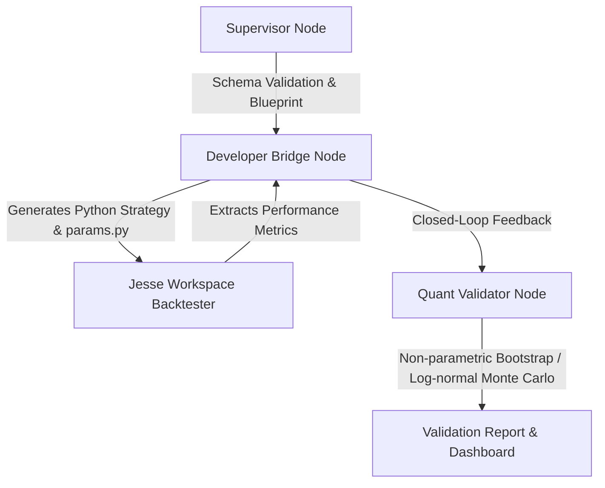

# Sovereign Quant Engine

The **Sovereign Quant Engine** is an advanced, automated pipeline designed to bridge generative model-based strategy logic with secure execution, verification, and stress testing. It operates as a closed-loop system targeting the [Jesse Algorithmic Trading Framework](https://jesse.trade/).

## Architecture & Components

The engine is modularized into three core layers designed for safe and robust deployment:



### 1. Supervisor Node (`core_engine/supervisor.py`)
- Responsible for system initialization and strict validation of configurations.
- Parses input schemas and generates the strategy blueprint (`payload_drop/strategy_blueprint.json`).

### 2. Developer Bridge Node (`core_engine/developer_bridge.py`)
- Translates blueprints into standard Jesse-compliant Strategy classes (`__init__.py` and `params.py`).
- **AST Security Parser**: Utilizes an AST-based parser that validates math expression syntax and rejects code injection vectors (e.g. function calls, attribute access).
- **Regime Switching**: Automatically supports custom hyperparameters keyed by market regimes (e.g., *trending_bullish*, *ranging_bearish*) and injects dynamic regime lookups at runtime.

### 3. Quantitative Validator (`core_engine/quant_validator.py`)
- Validates the backtest metrics against strict risk constraints.
- **Monte Carlo Simulator**: Upgraded simulation engine featuring:
  - **Non-Parametric Bootstrapping**: Performs trade-level resampling when historical trade returns are available to preserve empirical return distributions.
  - **Parametric Log-normal Mixture**: Fallback simulation that models fat-tailed behavior and asymmetrical return profiles (based on Sharpe ratio, win rate, and total trades) when raw logs are missing.
- Generates `validation_report.json` and stages a beautiful `validation_dashboard.html` for local visual analysis.

---

## Directory Structure

```bash
├── core_engine/                 # Core engine implementations
│   ├── supervisor.py            # Initialization & config check
│   ├── developer_bridge.py      # Python code generator & secure AST parser
│   ├── quant_validator.py       # Monte Carlo stress tester & report generator
│   └── mcp_executor.py          # Interface executor for Jesse toolsets
├── payload_drop/                # Blueprints, configurations & results
│   ├── strategy_blueprint.json  # Output target blueprint
│   ├── risk_constraints.json    # Target thresholds for risk metrics
│   ├── validation_report.json   # Output report from validation
│   └── validation_dashboard.html# Graphical UI for performance overview
├── jesse_workspace/             # Standard workspace environment for backtests
├── docs/                        # Project PDFs and documentation
├── tests/                       # Complete unit testing suite
├── run_simulation.py            # End-to-end pipeline runner script
└── requirements.txt             # Project requirements
```

---

## Installation & Setup

1. **Clone the repository**:
   ```bash
   git clone https://github.com/pomello03/sovereign-quant-engine.git
   cd sovereign-quant-engine
   ```

2. **Install dependencies**:
   ```bash
   pip install -r requirements.txt
   ```

3. **Run Unit Tests**:
   Ensure everything is operating correctly:
   ```bash
   pytest -v
   ```

4. **Execute End-to-End Simulation**:
   Run the full pipeline simulation, generating a blueprint, testing a mock strategy generation, and executing the Monte Carlo stress test:
   ```bash
   python run_simulation.py
   ```

---

## Security Invariants
- **No Unsafe Code**: All condition parsing is processed via Python's AST parser using a whitelist visitor. Function calls, arbitrary imports, and attribute reads (outside of pre-approved indicators) are rejected.
- **Regime Alignment**: The strategy hyperparameters map directly to distinct market states, shielding the portfolio from overfitting on single-regime dynamics.
