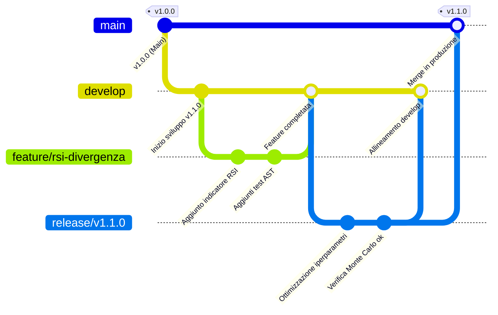

# Gestione delle Versioni e Modello di Branching (GitFlow)

Questo documento descrive il modello di controllo versione e rilascio adottato per il **Sovereign Quant Engine**. Per garantire la stabilità operativa di un sistema di trading algoritmico a ciclo chiuso, il progetto implementa una variante rigorosa del modello **GitFlow**, gestita in modo semi-autonomo dall'agente di intelligenza artificiale (Antigravity).

---

## 📈 Perché GitFlow per il Sovereign Quant Engine?

L'adozione di un modello strutturato come GitFlow per questo specifico progetto risponde a requisiti critici di sicurezza e integrità:

1. **Separazione tra Ricerca e Produzione:** Le strategie sperimentali (in fase di ottimizzazione o backtesting preliminare) non devono mai contaminare il codice stabile pronto per il trading live.
2. **Pipeline di Validazione Rigida:** Prima di essere promosso su un branch di produzione o integrazione, ogni modulo deve superare cancelli di qualità stringenti (audit statico, test unitari, validazione Monte Carlo).
3. **Tracciabilità delle Release:** Ogni versione caricata in produzione riceve un tag semantico (es. `v1.0.0`). Questo consente rollback istantanei a versioni stabili qualora il comportamento live diverga dai modelli teorici.
4. **Isolamento dei Bug (Hotfix):** Eventuali anomalie riscontrate in produzione (es. errori di connessione API del broker, scostamenti imprevisti dei limiti di rischio) possono essere corrette immediatamente senza interrompere lo sviluppo di nuove feature su altri branch.

---

## 🌳 Albero dei Branch e Ciclo di Vita

Il diagramma seguente mostra il flusso di lavoro e l'integrazione tra i diversi tipi di branch:



### 1. `main` (Produzione)
- **Scopo:** Rappresenta lo stato corrente di produzione del software, testato, validato e pronto per il deploy live.
- **Regola:** Non si committa **mai** direttamente su `main`. L'accesso a `main` avviene esclusivamente tramite merge da branch `release/*` o `hotfix/*`.
- **Rilascio:** Ogni commit su `main` corrisponde a una release ufficiale e deve essere taggata con una versione semantica (es. `v1.0.0`).

### 2. `develop` (Integrazione)
- **Scopo:** È il branch principale per l'integrazione di tutte le modifiche. Contiene l'ultimo codice pronto per la prossima release pianificata.
- **Regola:** Le modifiche vi giungono solo tramite merge da `feature/*`, `release/*` o `hotfix/*` dopo il superamento dei test e dell'audit.

### 3. `feature/*` (Sviluppo Funzionalità)
- **Scopo:** Sviluppo di nuovi indicatori, modifiche del motore, refactoring o nuove logiche di trading.
- **Nomenclatura:** `feature/nome-funzionalita` (es. `feature/ast-whitelist-expansion`).
- **Ciclo di vita:** Creato a partire da `develop`. Una volta completato il lavoro, superato l'audit (`./bin/sqe-audit.sh`) e passati i test (`pytest`), viene integrato nuovamente in `develop`.

### 4. `release/*` (Preparazione al Rilascio)
- **Scopo:** Stabilizzazione e validazione finale prima del rilascio in produzione. Qui si eseguono le ottimizzazioni di rischio Monte Carlo e la calibrazione finale.
- **Nomenclatura:** `release/vX.Y.Z` (es. `release/v1.1.0`).
- **Ciclo di vita:** Creato da `develop`. Sono permessi solo bugfix e piccoli ritocchi di configurazione. Una volta approvato il report di validazione, viene fuso sia in `main` (con tag `vX.Y.Z`) che in `develop`.

### 5. `hotfix/*` (Manutenzione di Emergenza)
- **Scopo:** Risoluzione immediata di problemi urgenti riscontrati sul branch `main`.
- **Nomenclatura:** `hotfix/descrizione-bug` (es. `hotfix/bybit-api-timeout`).
- **Ciclo di vita:** Creato direttamente da `main`. Dopo la correzione e la validazione dei test, viene fuso in `main` (taggando una patch release, es. `v1.0.1`) e in `develop`.

---

## 🤖 Regole per l'Agente IA (Modus Operandi)

L'agente (Antigravity) è istruito a gestire autonomamente le versioni e i branch seguendo rigorosamente queste istruzioni:

> [!IMPORTANT]
> **Cancelli di Qualità Obbligatori**
> Prima di eseguire un qualsiasi merge o rilascio, l'agente deve verificare che il codice compili senza avvertimenti e che la suite di test e l'audit statico abbiano esito positivo:
> 1. Eseguire `./bin/sqe-audit.sh` (Verifica Ruff, Vulture, Xenon).
> 2. Eseguire `pytest -v` (Verifica test unitari ed edge-case).

### Flusso di Sviluppo Standard dell'Agente

Quando l'utente richiede una nuova funzionalità o una modifica:

1. **Creazione del Branch di Lavoro:**
   L'agente crea un branch `feature/*` da `develop` (o direttamente da `main` se `develop` non esiste ancora):
   ```powershell
   & "C:\Program Files\Git\cmd\git.exe" checkout -b feature/nome-funzionalita develop
   ```
2. **Sviluppo e Validazione Locale:**
   L'agente implementa le modifiche e lancia l'audit e i test unitari. Se si verificano errori, li corregge nello stesso branch.
3. **Commit delle Modifiche:**
   I messaggi di commit devono descrivere in modo chiaro l'impatto delle modifiche:
   ```powershell
   & "C:\Program Files\Git\cmd\git.exe" add .
   & "C:\Program Files\Git\cmd\git.exe" commit -m "feat: aggiunto supporto per indicatori volumetrici"
   ```
4. **Merge su `develop`:**
   L'agente si sposta su `develop` e fonde il feature branch:
   ```powershell
   & "C:\Program Files\Git\cmd\git.exe" checkout develop
   & "C:\Program Files\Git\cmd\git.exe" merge --no-ff feature/nome-funzionalita
   & "C:\Program Files\Git\cmd\git.exe" push origin develop
   ```

### Flusso di Rilascio (Release) dell'Agente

Quando le modifiche accumulate su `develop` sono pronte per formare una nuova versione:

1. **Creazione del Branch di Release:**
   ```powershell
   & "C:\Program Files\Git\cmd\git.exe" checkout -b release/vX.Y.Z develop
   ```
2. **Esecuzione Simulazione di Validazione:**
   L'agente esegue `python run_simulation.py` per accertarsi che il validatore quantitativo approvi la stabilità della strategia a livello Monte Carlo.
3. **Merge su `main` e Creazione del Tag:**
   ```powershell
   & "C:\Program Files\Git\cmd\git.exe" checkout main
   & "C:\Program Files\Git\cmd\git.exe" merge --no-ff release/vX.Y.Z
   & "C:\Program Files\Git\cmd\git.exe" tag -a vX.Y.Z -m "Release vX.Y.Z - [Dettagli delle modifiche principali]"
   ```
4. **Allineamento di `develop` e Pulizia:**
   ```powershell
   & "C:\Program Files\Git\cmd\git.exe" checkout develop
   & "C:\Program Files\Git\cmd\git.exe" merge main
   & "C:\Program Files\Git\cmd\git.exe" push origin main develop --tags
   & "C:\Program Files\Git\cmd\git.exe" branch -d release/vX.Y.Z
   ```

---

## 🏷️ Convenzione di Versioning Semantico (SemVer)

Il formato della versione segue la struttura `vMAJOR.MINOR.PATCH`:

- **MAJOR:** Incrementato in caso di modifiche architetturali incompatibili con le versioni precedenti (es. riscrittura del Developer Bridge o cambio del framework Jesse).
- **MINOR:** Incrementato in caso di aggiunta di nuove funzionalità retrocompatibili (es. nuovi indicatori, miglioramento degli algoritmi di ottimizzazione, nuove metriche di validazione).
- **PATCH:** Incrementato per bugfix retrocompatibili (es. correzione di un errore AST, aggiornamento dipendenze di sicurezza).
